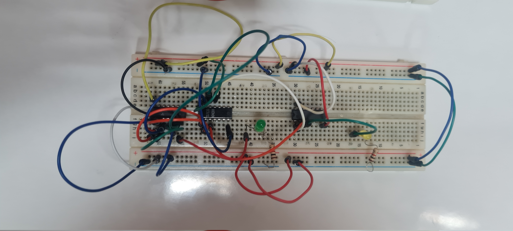
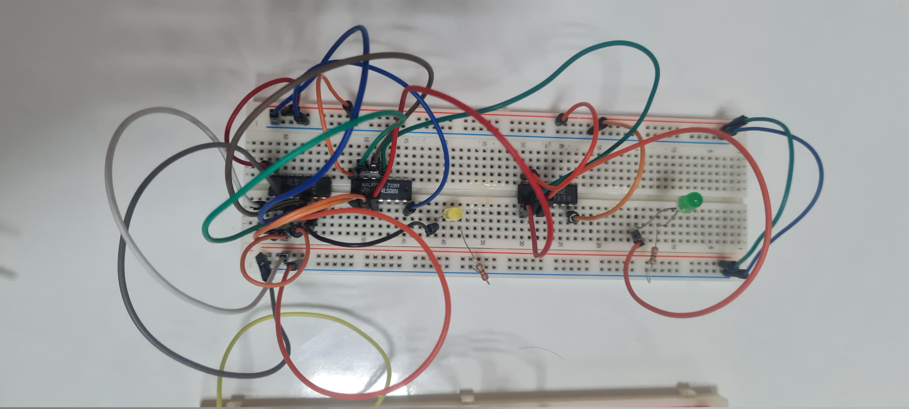
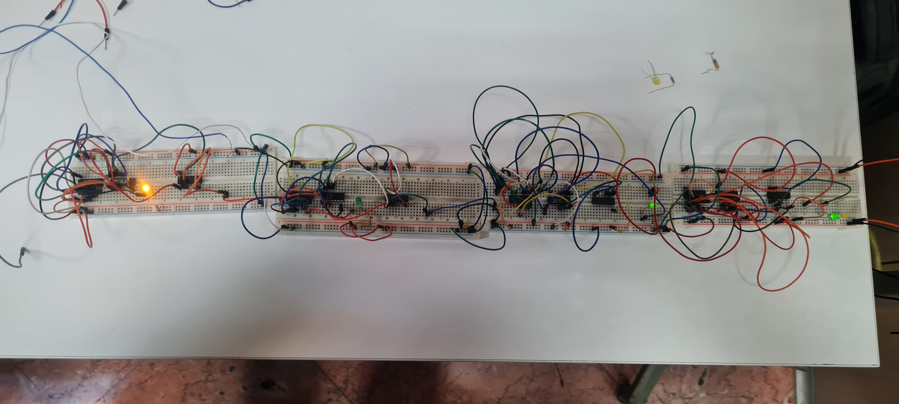
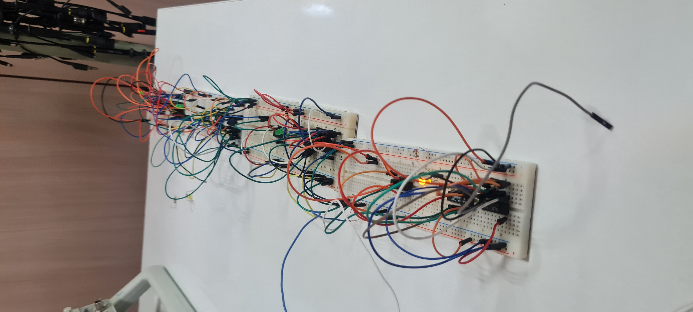

# Computer Architecture Laboratory
# 1st Experiment: Adder

|       Name        | Student # |
|-------------------|-----------|
| Amirreza Aranpour | 99170348  |
|  Ali Safarafard   | 99105583  |
| Soroush Sherafat  | 99105504  |
|  Mehrad Milanloo  | 99105775  |

## Proteus

At first, we know that if a digit of any of inputs is greater than $9$, then the input is not a valid BCD number. So we design a `INPUT_VALIDATOR` subcircuit which generates an `IS_INPUT_VALID` output bit.

To implement this subcircuit we need to implement a `IS_GT9` subcircuit first. This subcircuit must return a single bit, showing wether a 5-bit input is greater than 9 or not. Here's the truth table:

| Number | $a_4$ | $a_3$ | $a_2$ | $a_1$ | $a_0$ | $out$ |
|--------|-------|-------|-------|-------|-------|-------|
|  $0$   |  $0$  |  $0$  |  $0$  |  $0$  |  $0$  |  $0$  |
|  $1$   |  $0$  |  $0$  |  $0$  |  $0$  |  $0$  |  $0$  |
|  $2$   |  $0$  |  $0$  |  $0$  |  $1$  |  $0$  |  $0$  |
|  $3$   |  $0$  |  $0$  |  $0$  |  $1$  |  $0$  |  $0$  |
|  $4$   |  $0$  |  $0$  |  $1$  |  $0$  |  $0$  |  $0$  |
|  $5$   |  $0$  |  $0$  |  $1$  |  $0$  |  $0$  |  $0$  |
|  $6$   |  $0$  |  $0$  |  $1$  |  $1$  |  $0$  |  $0$  |
|  $7$   |  $0$  |  $0$  |  $1$  |  $1$  |  $0$  |  $0$  |
|  $8$   |  $0$  |  $1$  |  $0$  |  $0$  |  $0$  |  $0$  |
|  $9$   |  $0$  |  $1$  |  $0$  |  $0$  |  $0$  |  $0$  |
|  $10$  |  $0$  |  $1$  |  $0$  |  $1$  |  $0$  |  $1$  |
|  $11$  |  $0$  |  $1$  |  $0$  |  $1$  |  $0$  |  $1$  |
|  $12$  |  $0$  |  $1$  |  $1$  |  $0$  |  $0$  |  $1$  |
|  $13$  |  $0$  |  $1$  |  $1$  |  $0$  |  $0$  |  $1$  |
|  $14$  |  $0$  |  $1$  |  $1$  |  $1$  |  $0$  |  $1$  |
|  $15$  |  $0$  |  $1$  |  $1$  |  $1$  |  $0$  |  $1$  |
|  $16$  |  $1$  |  $0$  |  $0$  |  $0$  |  $0$  |  $1$  |
|  $17$  |  $1$  |  $0$  |  $0$  |  $0$  |  $0$  |  $1$  |
|  $18$  |  $1$  |  $0$  |  $0$  |  $1$  |  $0$  |  $1$  |
|  $19$  |  $1$  |  $0$  |  $0$  |  $1$  |  $0$  |  $1$  |
|  $20$  |  $1$  |  $0$  |  $1$  |  $0$  |  $0$  |  $1$  |
|  $21$  |  $1$  |  $0$  |  $1$  |  $0$  |  $0$  |  $1$  |
|  $22$  |  $1$  |  $0$  |  $1$  |  $1$  |  $0$  |  $1$  |
|  $23$  |  $1$  |  $0$  |  $1$  |  $1$  |  $0$  |  $1$  |
|  $24$  |  $1$  |  $1$  |  $0$  |  $0$  |  $0$  |  $1$  |
|  $25$  |  $1$  |  $1$  |  $0$  |  $0$  |  $0$  |  $1$  |
|  $26$  |  $1$  |  $1$  |  $0$  |  $1$  |  $0$  |  $1$  |
|  $27$  |  $1$  |  $1$  |  $0$  |  $1$  |  $0$  |  $1$  |
|  $28$  |  $1$  |  $1$  |  $1$  |  $0$  |  $0$  |  $1$  |
|  $29$  |  $1$  |  $1$  |  $1$  |  $0$  |  $0$  |  $1$  |
|  $30$  |  $1$  |  $1$  |  $1$  |  $1$  |  $0$  |  $1$  |
|  $31$  |  $1$  |  $1$  |  $1$  |  $1$  |  $0$  |  $1$  |

Here's the equation:

$$out := a_4 \lor (a_3 \land a_2) \lor (a_3 \land a_1)$$

We realize that just like binary adders, n-digit BCD adders are composed of n 1-digit BCD adders with connected $Cin$s and $Cout$s and therefore, we need to design 1-digit BCD adders.

A 1-digit BCD adder is a 4-bit binary adder under the hood, with one difference: if the sum is greater than $9$, we will output $Sum - 10$ as $Sum$ and $1$ as $Cout$. We reuse the `IS_GT9` subcircuit to detect these cases.

To generate $Sum - 10$, we use another 4-bit binary adder. Here is its second operand's truth table:

| $gt9$ | $out_3$ | $out_2$ | $out_1$ | $out_0$ |
|-------|---------|---------|---------|---------|
|  $0$  |   $0$   |   $0$   |   $0$   |   $0$   |
|  $1$  |   $0$   |   $1$   |   $1$   |   $0$   |

So we get the following equations:

$$out_3 := 0, out_2 := gt9, out_1 := gt9, out_0 := 0$$

To design a 4-bit binary adder, we need full adders and to design full adders, we need half adders.

## Board

Since we already designed and implemented a 4-bit binary adder in our Proteus project, we don't need to design it again here.

We split up and each team member, built a single full-adder using the following ICs:

|   IC   | Name  | Count |
|--------|-------|-------|
| $7408$ | *AND* |  $1$  |
| $7432$ | *OR*  |  $1$  |
| $7486$ | *XOR* |  $1$  |

Here's some pictures of the adder:

