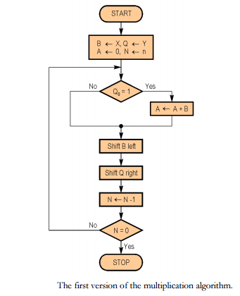
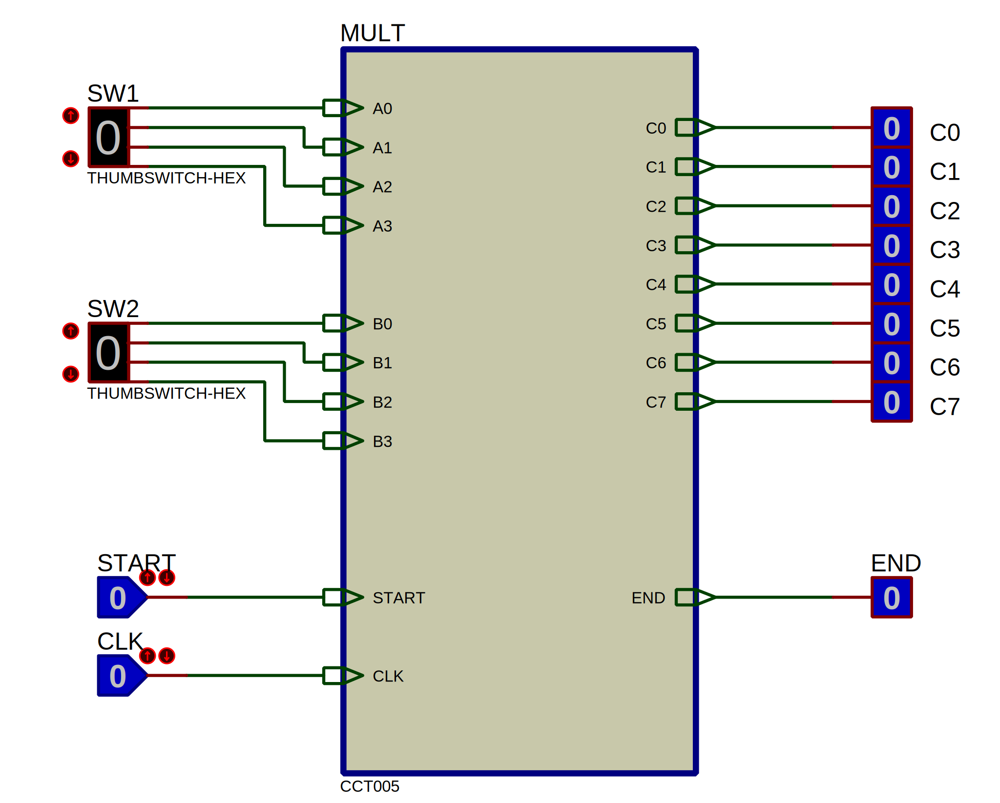
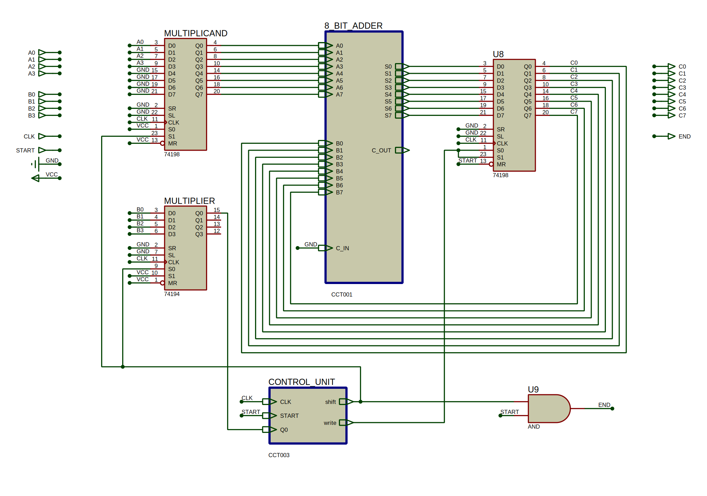
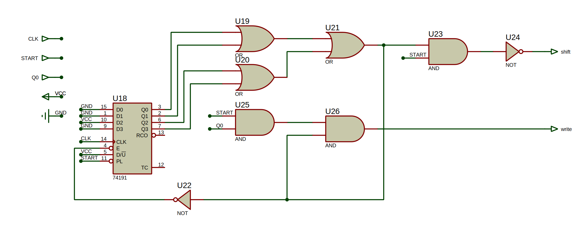
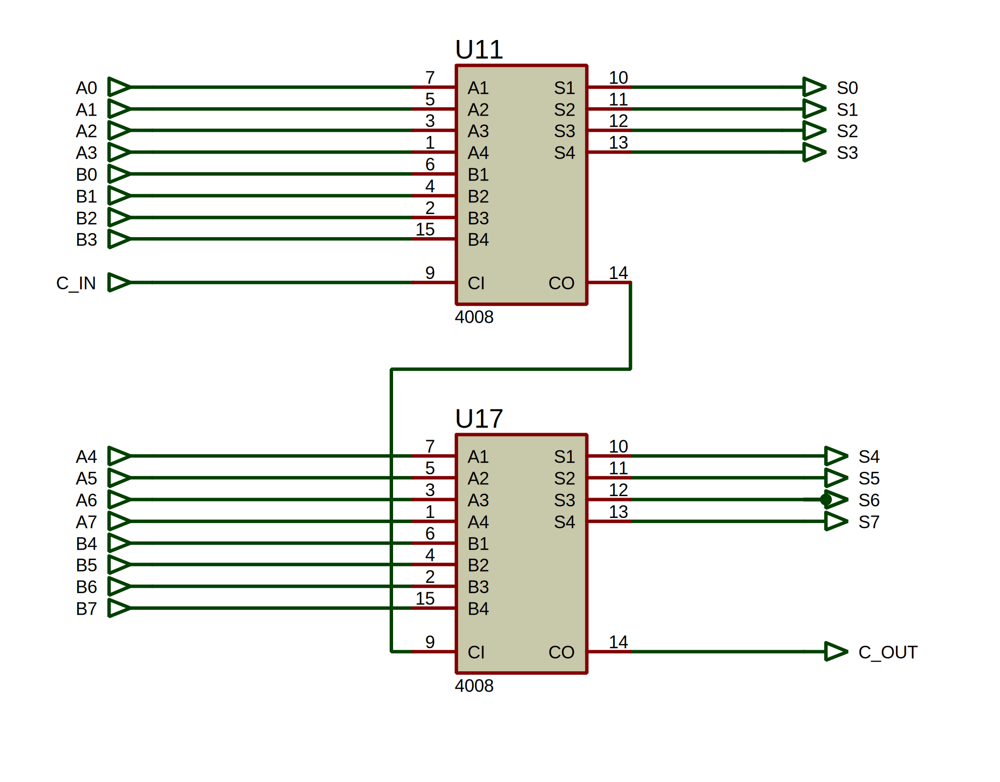
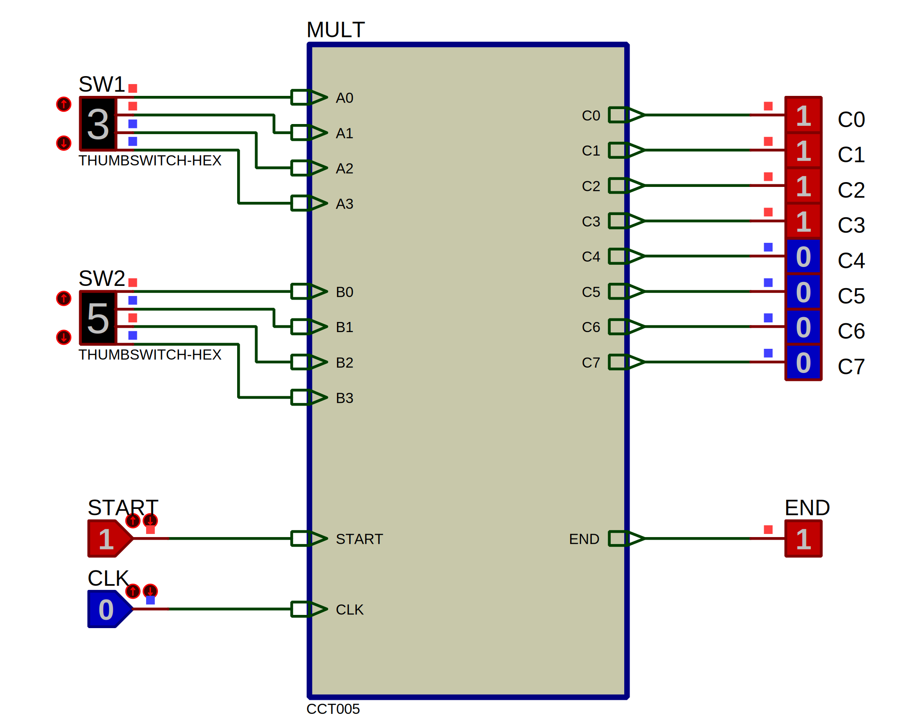
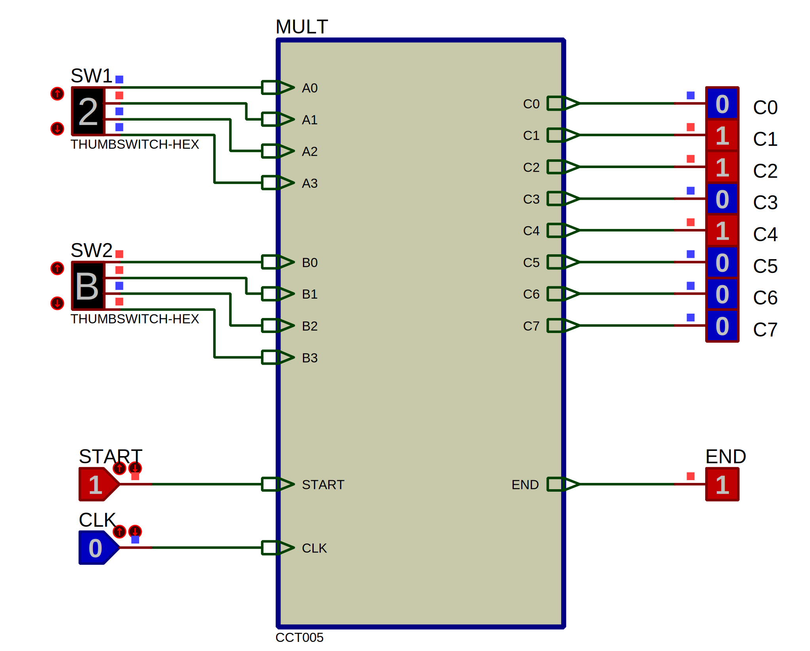
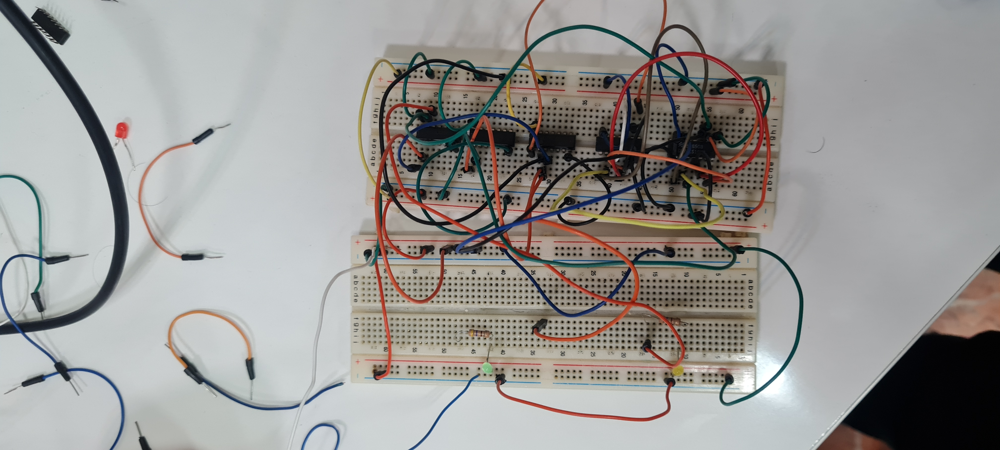
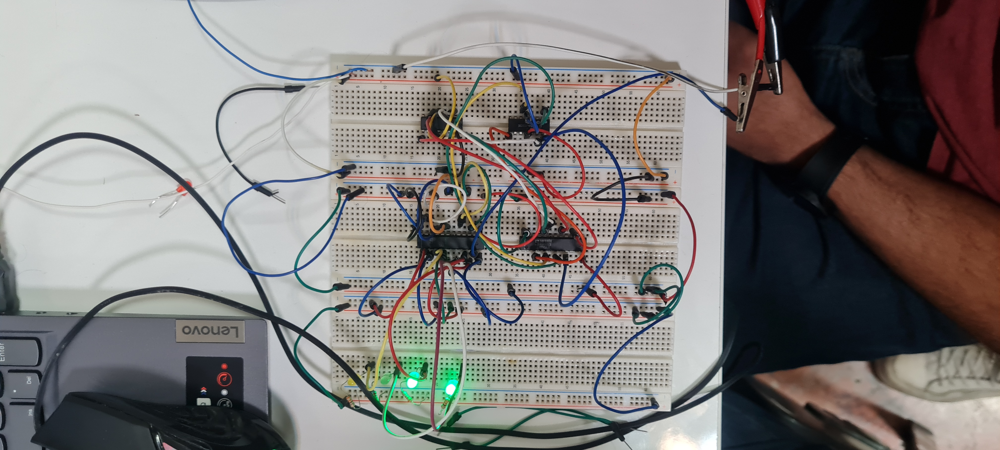

# Computer Architecture Laboratory
# 2nd Experiment: Multiplier

|       Name        | Student # |
|-------------------|-----------|
| Amirreza Aranpour | 99170348  |
|  Ali Safarafard   | 99105583  |
| Soroush Sherafat  | 99105504  |
|  Mehrad Milanloo  | 99105775  |

## Design

### Algorithm

We use *shift & add* algorithm. It is similar to how we learned to multiply numbers in elementary school.

Here's the main idea:

1. Multiply each multiplier digit in multiplicand.
2. Shift each product to left based on the value of its corresponding multiplier digit.
3. Add these values.

Note that since we are storing numbers in binary format, the digit multiplication could be simplified:

```c
bit * number = bit ? number : 0;
```

### ASM Chart

The algorithm can be demonstrated in the attached ASM chart in Figure 1.



### Implementation

To implement the multiplier, we need to first implement the control unit and the data path.

#### Control Unit

As one can see from the ASM chart, there are two controlling signals: *shift* and *write*.

##### Shift

The *shift* controlling signal marks when the multiplicand must shift to left and the multiplier must shift to right so we can go on with the multiplication process.

We must shift when the process of multiplication is not done, meaning the counter has not yet reached zero, and also the user still wants to finish the multiplication meaning the $start$ signal equals $1$.

$$shift := start \land (| counter)$$

##### Write

The *write* controlling signal marks when we must write the new sum result into our product register. It is the same as shift with one difference: we should not write the new results to product register when multiplier's LSB equals $0$ because in that case, the product of multiplier's LSB and multiplicand also equals $0$ and we should not add multiplicand to the product.

$$write := start \land multiplier_0 \land (| counter)$$

#### Data Path

Our data path uses 3 registers and one adder:

1. **Multiplier register** is a right-shift 8-bit register that only shifts to right when *shift* controlling signal is enabled.
2. **Multiplicand register** is a left-shift 4-bit register that only shifts to left when *shift* controlling signal is enabled.
3. **Product register** is a regular 8-bit register that accumulates the shifted multiplicand values, when the corresponding multiplier LSB value is $1$. It only stores values of the adder when the *write* controlling signal is enabled.
4. **8-bit adder** is an adder that its operands are the multiplicand and product registers and its value is stored in the product register.

## Proteus

### Implementation

We have already discussed the design so we dive right into our implemented Proteus design. Figures 2-5 show our Proteus design.









### Verification

Figure 6 and Figure 7 show two sample tests that show how our design is correct. More tests were done but are not included here.





## Board

We split up into two groups.

The first group implemented the control unit using the following ICs:

|   IC    |            Name         | Count |
|---------|-------------------------|-------|
| $7403$  |           *NAND*        |  $1$  |
| $7404$  |           *NOT*         |  $1$  |
| $7411$  |       *3-Input AND*     |  $1$  |
| $7432$  |           *OR*          |  $1$  |
| $74191$ | *4-bit Up/Down Counter* |  $1$  |

And the second group implemented the data path using the following ICs:

|   IC    |           Name         | Count |
|---------|------------------------|-------|
| $7408$  |          *AND*         |  $1$  |
| $7483$  |      *4-bit Adder*     |  $2$  |
| $74194$ | *4-bit Shift Register* |  $1$  |
| $74198$ | *8-bit Shift Register* |  $2$  |

Figure 8 and Figure 9 show the circuits.






