# Computer Architecture Laboratory
# 3rd Experiment: Floating Point Adder/Subtractor

|       Name        | Student # |
|-------------------|-----------|
| Amirreza Aranpour | 99170348  |
|  Ali Safarafard   | 99105583  |
| Soroush Sherafat  | 99105504  |
|  Mehrad Milanloo  | 99105775  |

## Algorithm

In Figure 1, one can see a high-level overview of a floating-point adder organization, from what we learned in Computer Architecture course.

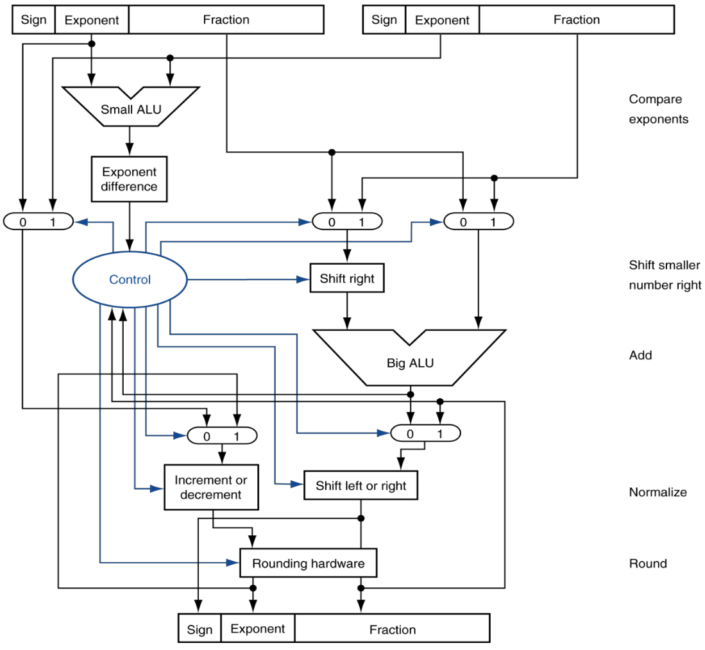

Our algorithm consists of the following steps:

1. Calculate the sign of $b$ since the module is an adder/subtractor.
2. Find out which one between $a$ and $b$ has a smaller exponent.
3. Concatenate the implicit $1$ to the left side of both mantisses.
4. Shift the operand with smaller exponent's mantisse to right while incrementing its exponent, to the point that exponents are equal.
5. Calculate the 2nd compliment of both $a$ and $b$ mantisse if necessary, based on their sign.
6. Perform the addition on their mantisses.
7. Detect potential overflows.
8. Calculate the sign of the addition output.
9. Calculate the absolute value of the sum.
10. If the sum equals $0$, return.
11. Check if the sum needs to be normalized.
12. Shift the the sum mantisse to right and increment the exponent if necessary.
13. Keep shifting the sum mantisse to left and decrementing the exponent if necessary.
14. Make MSB $1$ bit implicit.

## Components

We designed and implemented the following components:

- Difference calculator (Figure 2)
- Counter (Figure 3)
- Multiplexer (Figure 4)
- Shift register (Figure 5)
- Complementor (Figure 6)
- Binary adder (implemented previously)

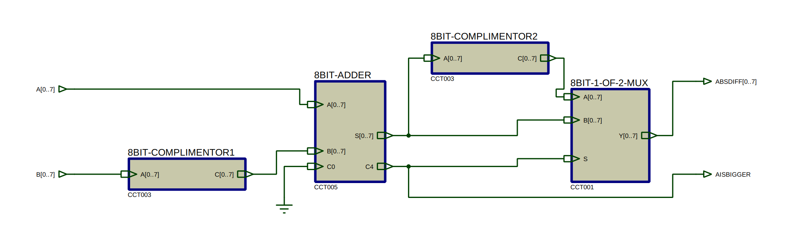

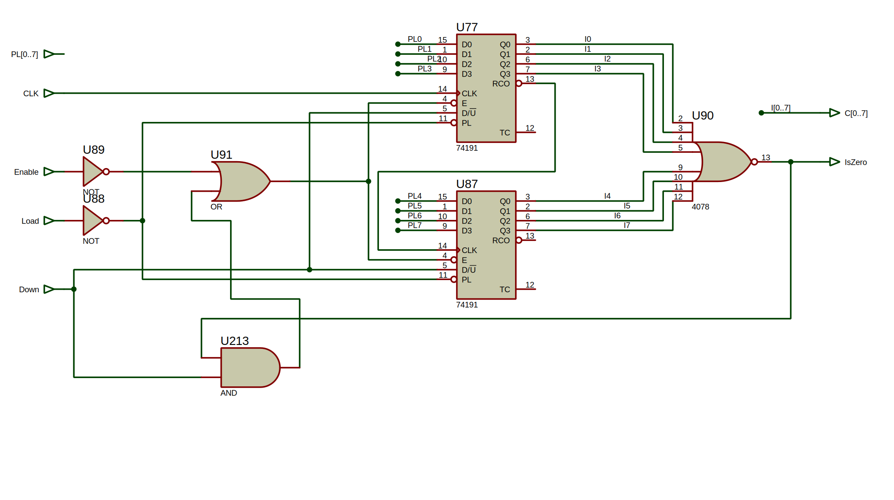

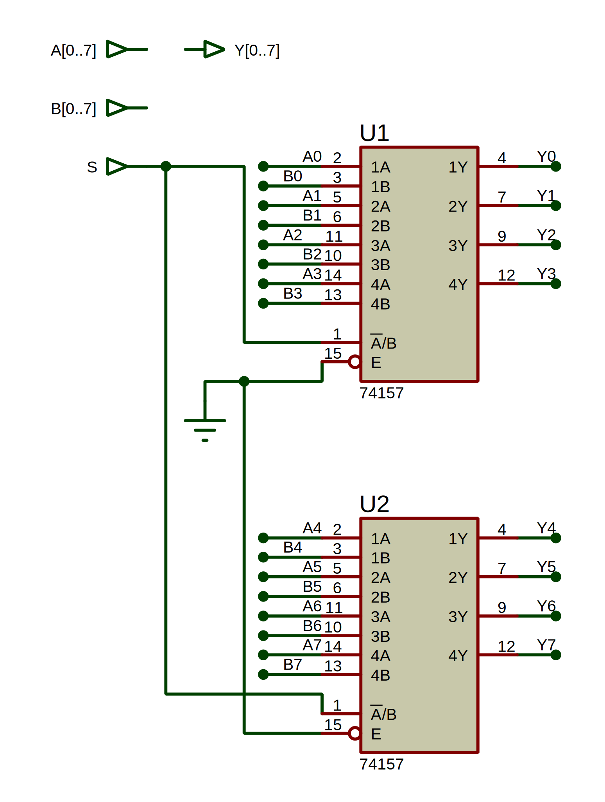

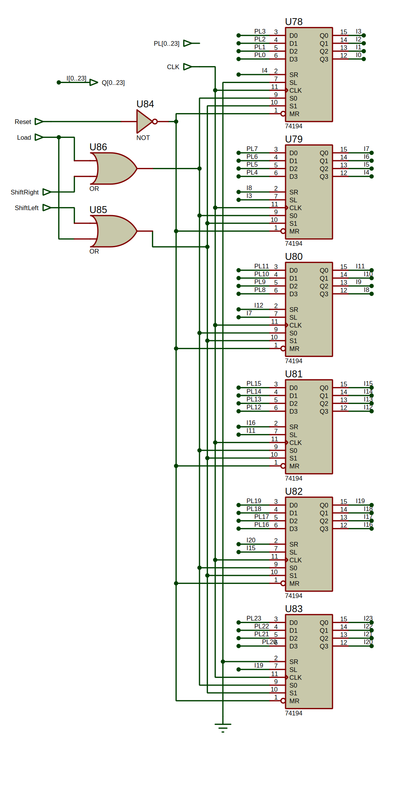

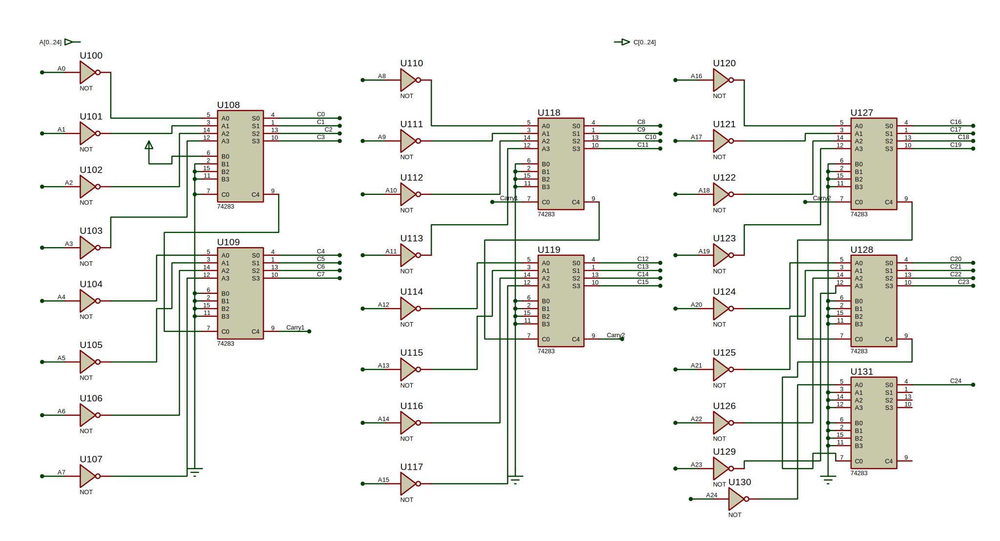

## Top Module

Figure 7 shows the top module that is responsible for calculating the sum or difference of two floating-point numbers.

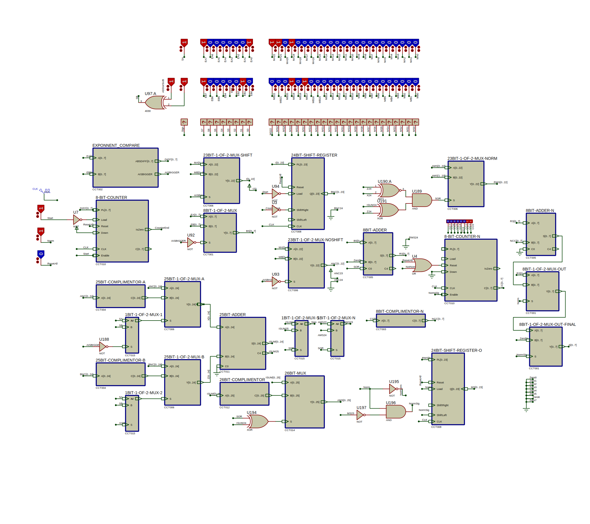

Let's break it down:

### $b$ Sign

Our module is an adder/subtractor so it must be able to calculate $a + b$ and $a - b$. On the other hand, both $a$ and $b$ are signed floating-point numbers and can be positive or negative.

Therefore we calculate the actual sign of $b$ using the following formula:

$$sign_b = initial\:sign_b \oplus is\:subtraction$$

### Comparing Exponents

The `EXPONENT_COMPARE` module is responsible for comparing $exponent_a$ and $exponent_b$ and calculating $|exponent_a - exponent_b|$. It has two outputs:

| | |
|-|-|
|`A_IS_BIGGER`| $1$ if $exponent_a > exponent_b$ or else $0$|
|`ABS_DIFF[7..0]` | $\lvert exponent_a - exponent_b \rvert$ |

### Concatenate the Implicit $1$

We need the implicit $1$ concatenated to the left side of our mantisses if we want the sum value to be correct. We simply do this by creating two new buses called `ANC` and `BNC`. We also concatenate a $0$ because we need to calculate the two's complement value of our mantisses shortly and it is necessary that our currently positive values have a MSB of $0$.

### Shifting the Operand With Smaller Exponent

We use some multiplexers with `A_IS_BIGGER` select signal to pick the operand with smaller exponent and save its mantisse in a shift register. We save `ABS_DIFF[7..0]` into a decrementing counter and keep shifting the mantisse to right, until the value in the counter reaches $0$.

### Making the Mantisses Signed

Right now, we have unsigned mantisses and a sign bit that shows its actual signed value. We firstly calculate $a$ and $b$'s two's complement values and then use their sign bits as the select signal of two multiplexers to choose between the positive and negative values of the mantisses.

### Add the Mantisses

Now we can simply add the two signed mantisse values since they have the same exponent value as well.

### Detect Overflow

We need a form of normalization if an overflow occurs during the addition that we will explain later. For now, we need to detect overflow.

An overflow occurs in a signed addition if and only if sum of two positive/negative numbers is negative/positive. So we use the following equation to detect the overflow and save the value to `SOR`:

$$overflow = (sign_a \oplus MSB_{sum}) \land (sign_a \odot sign_b)$$

### Calculate Sum Sign

Calculating a number's sign is trivial but the possibility of overflow complicates it a little.

If an overflow occurs, the sign will be wrong. For example, if we add two positive numbers, the sum will obviously be positive but if an overflow occurs, its MSB will be $1$ and we might think that the sum is negative.

So we use the following equation to detect the sign of the sum:

$$sign_{sum} = MSB_{sum} \oplus overflow$$

### Calculate $sum$ Absolute Value

We calculate $sum$ absolute value, pretty similar to what we did before. A module is responsible for calculating $sum$'s two's complement and $sign_{sum}$ is used as the select signal of a multiplexer that will choose between $sum$ and $-sum$.

### Check For $0$

We then check if $sum$ equals to $0$ and simply output all $0$ bits if that is the case.

### Normalization

There are two types of normalizations that we need to consider:

- Right shift normalization
- Left shift normalization

#### Right Shift Normalization

If $overflow$ equals $1$, we need to normalize $sum$ by shifting its mantisse to right for one bit and incrementing its exponent. Note that this is the case when operands have the same sign and their sum's exponent is larger than exponent of each one of them.

#### Left Shift Normalization

If two operands have different signs, there is a possibility that the sum's exponent will be smaller than the largest exponent of the operands and this means that the sum needs to be normalized.

We must keep shifting the mantisse to left and decrementing the exponent, until the MSB $1$ bit is in the position of the implicit $1$.

### The Implicit $1$

Before outputting the sum, we need to ignore the implicit $1$ bit and only output the 23 bits that come after it.

## Verification

We verify our design and implementation by using 4 testcases that cover the 4 fundamental scenarios:

- No normalization
- Right shift normalization
- Left shift normalization
- $0$ result

### No Normalization Scenario Verification

Figure 8 shows the result of `0b0011_1111_0010_0000_0000_0000_0000_0000f + 0b1101_1111_1110_0000_0000_0000_0000_0000f == 0b1011_1111_1001_0000_0000_0000_0000_0000f` or $0.625 - 1.75 = -1.125.$.

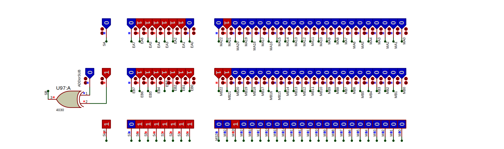

### Right Shift Normalization Scenario Verification

Figure 9 shows the result of `0b1011_1111_0010_0000_0000_0000_0000_0000f + 0b1011_1111_1110_0000_0000_0000_0000_0000f == 0b1100_0000_0001_1000_0000_0000_0000_0000f` or $-0.625 - 1.75 = -2.375$.

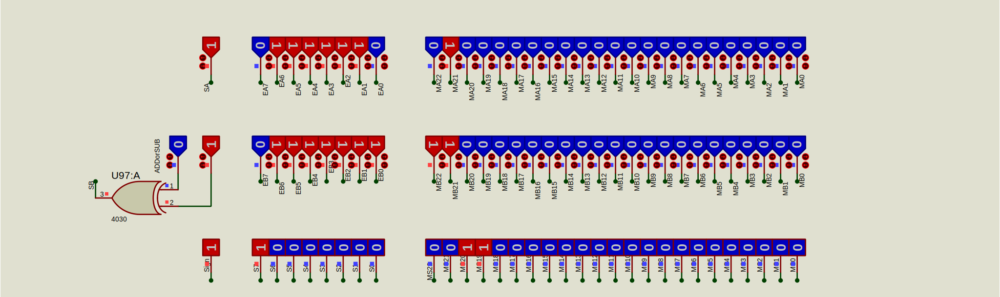

### Left Shift Normalization Scenario Verification

Figure 10 shows the result of `0b1100_0000_1110_1000_0000_0000_0000_0000f - 0b1100_0001_0000_1010_0000_0000_0000_0000f == 0b0011_1111_1011_0000_0000_0000_0000_0000f` or $-7.25 - (-8.625) = 1.375$.

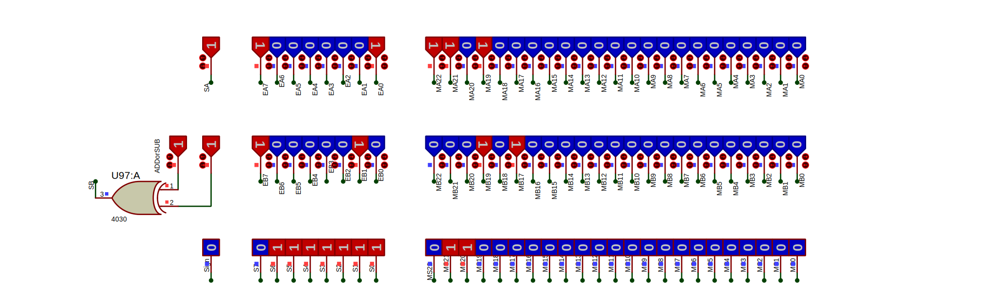

### $0$ Result Scenario Verification

Figure 11 shows the result of `0b0100_0000_1110_0000_0000_0000_0000_0000f - 0b0100_0000_1110_0000_0000_0000_0000_0000f == 0b0000_0000_0000_0000_0000_0000_0000_0000f` or $7 - 7 = 0$.

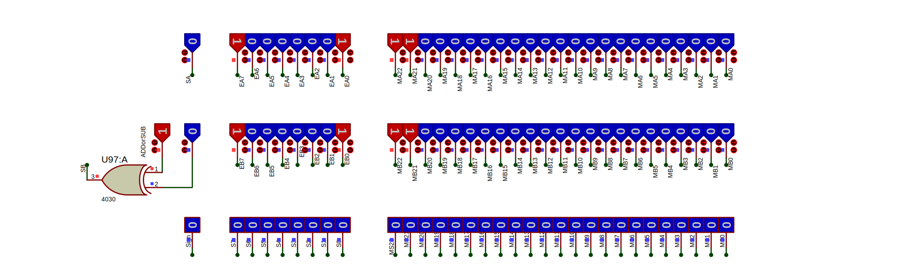
