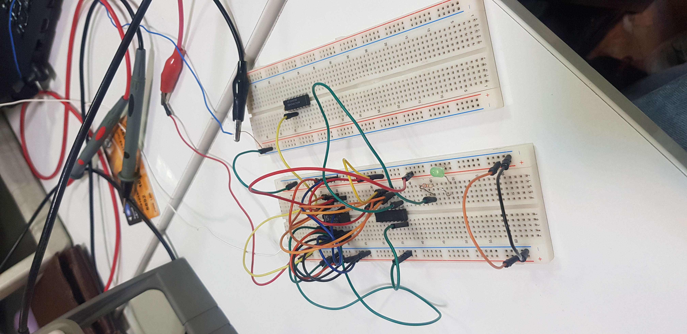
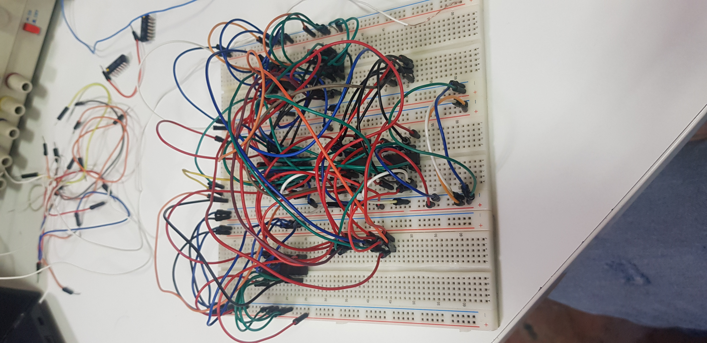

# Computer Architecture Laboratory
# 4th Experiment: BCD-to-Binary Convertor

|       Name        | Student # |
|-------------------|-----------|
| Amirreza Aranpour | 99170348  |
|  Ali Safarafard   | 99105583  |
| Soroush Sherafat  | 99105504  |
|  Mehrad Milanloo  | 99105775  |

## Design

### Algorithm

Now, we will explain the general algorithm for the operation of this circuit:

In every clock cycle, based on the current state, we perform one of the two following tasks:

1. We shift the input bits one unit to the right. In such a way that the least significant bit (LSB) of any number becomes the most significant bit (MSB) of the next number. Also, the least significant bit of all the numbers (LSB of the last number) goes into the subsequent shift registers related to the output.

2. For each output of each of the shift registers that we have shifted their bits one unit to the right, if the input bit to them (MSB) is equal to $1$, we subtract the number $3$ from it, meaning we add it to $13$ and ignore the carry bit.

The reason for the second operation is that with every shift to the right, we have actually divided the entire binary number by $2$. Now, if a bit of $1$ enters any of the numbers, it's as if we have added $8$, but in decimal numbers, the carry digit is $10$, which when divided by $2$, equals $5$. Therefore, a subtraction operation of $3$ is needed to convert $8$ to $5$. Intuitively, it seems like this subtraction of the digit $3$ causes the conversion of the BCD number to binary.

### Implementation

In this experiment, using a sequential circuit, we have designed a converter from BCD to Binary numbers. According to the procedure, we assume that the number of input digits is 3. Therefore, the entered number can be a maximum of $999$ and a minimum of $0$. Given this, we will need at least $10$ bits to represent the binary of the entered number since:

$$\lceil \log_2999 \rceil = 10$$

Initially, we will examine the subcircuit `BCD_TO_BINARY`. First, it's necessary to read the inputs and save them into the shift registers. For each BCD digit, we have set a shift register to ensure the circuit's clarity and readability.

Before reaching the 4-bit shift registers, the inputs must pass through a multiplexer (MUX). Note that one input of these multiplexers is the entered number, and the other is the output of the adders, which we will explain later. As evident from the enable (`E`) control signal, only when the `INIT` signal is activated do the numbers `A`, `B` and `C` enter their MUX. This signal, considered an input to the circuit, plays the role of an initiator. To start the circuit function, first, we set it to 1, then set it to 0.

In this circuit, we generally have two states, `SHIFT` and `REDUCE`. At each clock, it's the turn of one of them. We determine the current state using a D flip-flop. (Note that the reset (`R`) signal of this flip-flop is set to `INIT`, meaning that at the beginning, the flip-flop is reset.)

Given the algorithm, the role of the adders is clear. When we are not in the `SHIFT` state, each number is added with `XX0X` where `X` is the same as the MSB of the number. Meaning, if it's $1$, it gets added to $13$, and if it's $0$, it remains unchanged and is reloaded into the shift register.

Ultimately, we have three 4-bit shift registers. The output bits from the previous shift registers, as we explained, enter these registers and shifted to the right at every stage. But the question is, how many times should we repeat this algorithm?

As mentioned at the beginning of the report, 3-digit decimal numbers fit into $10$ bits. Therefore, it's enough to perform the shift operation $10$ times. For this reason, we have decrementing counter that initially loads $10$ and after the `INIT` signal becomes $0$ at the beginning, counts down from $10$ to $0$. When the counter reaches $0$, it stops the counting and activates the `END` signal. The activation of this signal, considering the inputs of the shift registers, ensures no more shifting operations occur and the number remains constant. The activation of this signal effectively indicates the end of the converter's operation.

Also To ensure the circuit inputs are correct, we have used a `VALIDATOR` module that takes the numbers as input and checks for each number to ensure it's less than $10$ and are a valid single digit. We easily do this using and and or gates. If the output is invalid, the circuit's `VALID` signal becomes $0$, and the `END` signal at the beginning becomes $1$, causing the output number to remain $0$, indicating the given number is invalid.

## Proteus

### Implementation

We have already discussed the design so we dive right into our implemented Proteus design. Figures 1 and 2 show the subcircuits that are designed to validate the input and Figure 3 shows the internals of our `BCD_TO_BINARY`.

### Verification

Figures 4-7 show how our module outputs the right binary number for its BCD input and Figure 8 shows how the `VALIDATOR` subcircuit detects an invalid BCD input and outputs $0$ value for the `VALID` signal.

## Board

We decided to go with an identical 2-digit version of our Proteus design, without the `VALIDATOR` subcircuit.

The first group created the controlling signals like `SHIFT`, `RESUME` and `END` using gate-level logic, a counter and a D flip-flop.

The second group used the controlling signals to shift the input digits, subtract $3$ from them when necessary and generate the output. The used multiplexers, adders and shift registers.

Figures 9 and 10 show our work, even though we couldn't get it to work in the class time.

