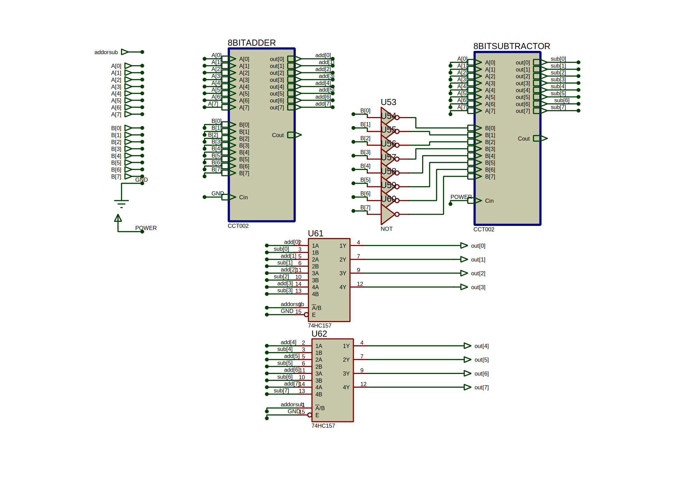
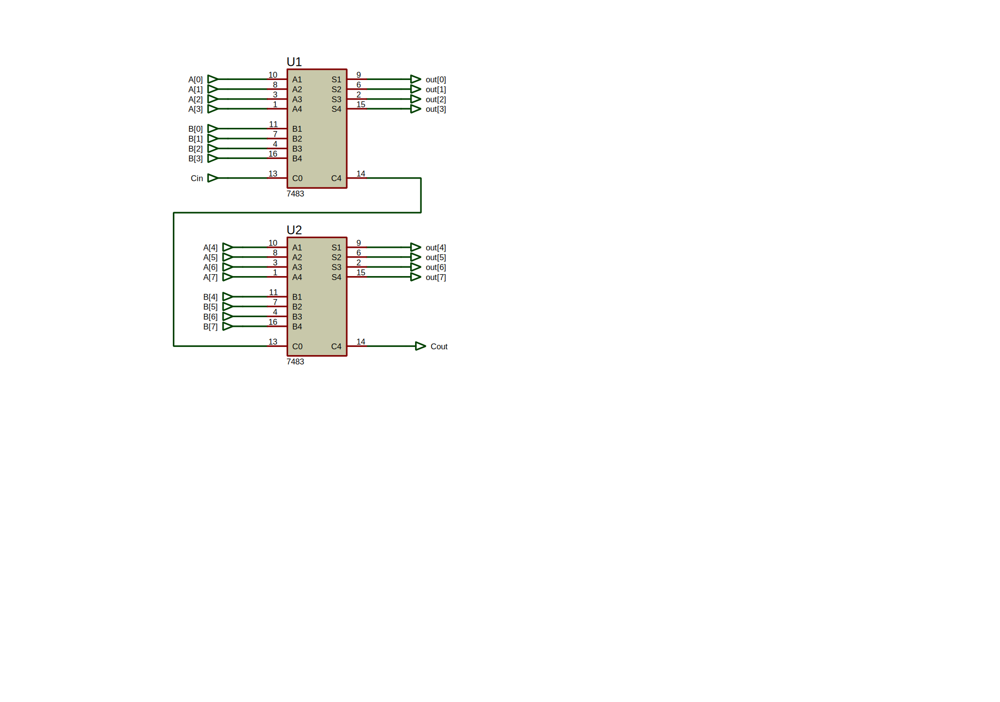
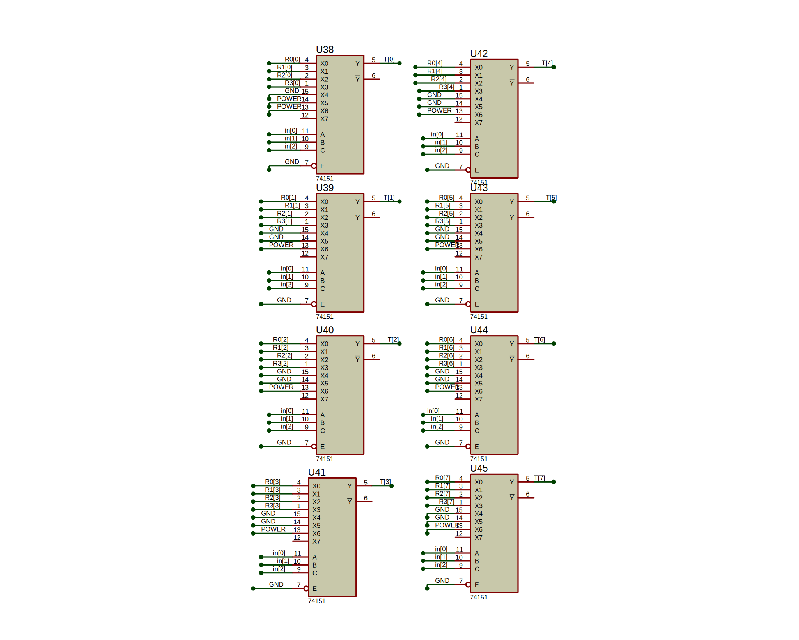
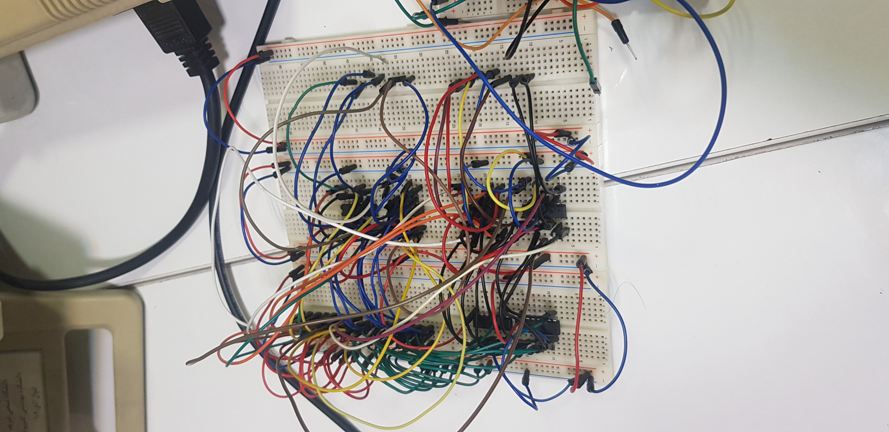
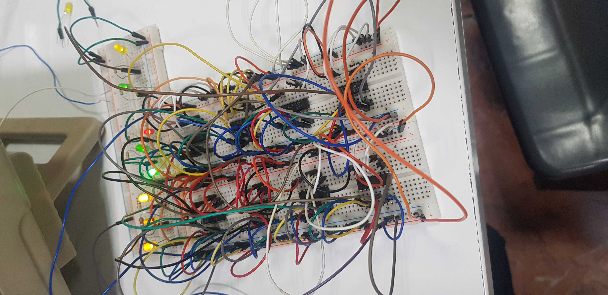
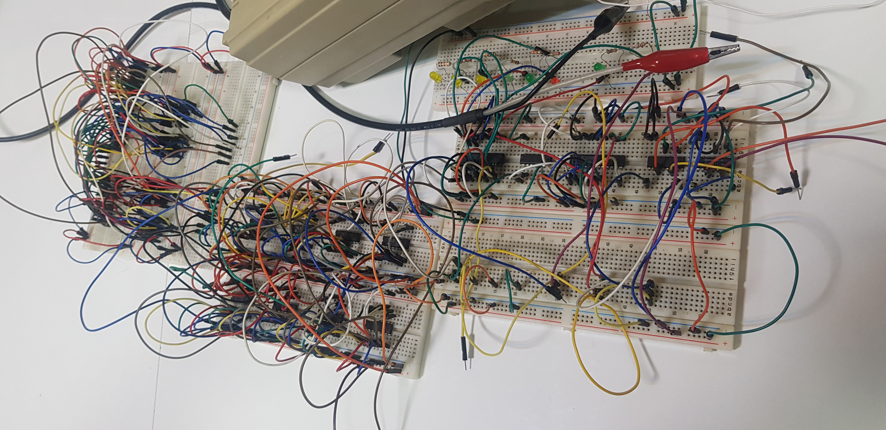

# Computer Architecture Laboratory
# 5th Experiment: ALU

|       Name        | Student # |
|-------------------|-----------|
| Amirreza Aranpour | 99170348  |
|  Ali Safarafard   | 99105583  |
| Soroush Sherafat  | 99105504  |
|  Mehrad Milanloo  | 99105775  |

## Design

We aim to design and implement a simplified ALU that takes 8-bit operands and does some calculations (add or sub) based on some controlling signals values.

### Input

#### `in[5]`

This bit decides between the addition and subtraction operations.

| `in[5]` | Operation |
|---------|-----------|
|   $0$   |    Add    |
|   $1$   |  Subtract |

#### `in[4:3]`

These two bits choose the destination register, in which the result of the addition/subtraction will be written.

| `in[4:3]` | Destination |
|-----------|-------------|
|    $00$   |     `R0`    |
|    $01$   |     `R1`    |
|    $10$   |     `R2`    |
|    $11$   |     `R3`    |

#### `in[2:0]`

Every ALU operation has an implicit `R0` operand. `in[2:0]` bits choose the second source operand between registers and immediate values.

|  `in[2:0]` | Source Operand |
|------------|----------------|
|    $000$   |      `R0`      |
|    $001$   |      `R1`      |
|    $010$   |      `R2`      |
|    $011$   |      `R3`      |
|    $100$   |      $0$       |
|    $101$   |      $1$       |
|    $111$   |      $-1$      |

#### `M[7:0]`

`M[7:0]` is an 8-bit input that is used as our registers' parallel load input.

#### `Load`

This bit decides between loading `M[7:0]` into the destination register our ALU's result.

|  `Load` | Operation |
|---------|-----------|
|   $0$   |      M    |
|   $1$   |    Load   |

#### `Clear`

An active-low asynchronous input that clears all of our registers.

### Functionality

Our design consists of four 8-bit registers, eight 8-to-1 multiplexers, a 2-to-4 decoder, and an Arithmetic Logic Unit (ALU) module, which encompasses two 8-bit adders comprising of two 4-bit adders each, one functioning as an adder and the other as a subtractor. It also includes a multiplexer for operation selection and another multiplexer for output selection or parallel loading of bits. The operational functionality of these components is elucidated as follows.

Initially, the destination register input is fed into the decoder, selecting one of the four designated registers through the Enable lines to activate and execute a load operation. The inputs to these storage elements, denoted as `X` or `M`, are chosen by a multiplexer activated by the `Load/M` selection line, with either the ALU output or parallel inputs being selected based on this choice.

Within the eight multiplexers, denoted as "i" where i ranges from 0 to 7, the i-th bit of each of the four registers is provided as input, and with the simultaneous activation of the same select line, the corresponding bits are chosen. Notably, the values $0$, $1$, and $-1$ are hardwired within these multiplexers according to their binary representations (bits `0`, `1`), respectively. Finally, the outputs of these multiplexers are directed to the adder and subtractor section. Another input to this section corresponds to the outputs of register `R0`, which is an implicit operand. The signal to select addition or subtraction, as described earlier, forms another input to this section.

In the ALU, the provided data inputs undergo both addition and subtraction processes, with the multiplexer aiding in the selection of output between the two adder outputs. It is noteworthy that an 8-bit subtractor can be readily constructed using the 2's complement method and utilizing two 4-bit adders where all bits of the second input are inverted, and the carry bit of the lesser valued adder is set to 1. Ultimately, the output of this section is fed back into the circuit as `X`.

Ultimately, during each clock cycle, the circuit's output comprises the output bits of the registers, and their values hold significance. Notably, the operations occur when the clock signal enters the circuit. Hence, selecting a register, aside from the one intended to observe results, as the destination register causes the inputs `S0` and `S1` of the main register to remain at $1$, effectively preserving the values in a Hold state.

## Proteus

### Implementation

We have already discussed the design so we dive right into our implemented Proteus design.

Figure 1 shows the registers and the logic behind the storing the values in registers.

Figure 2 shows our implementation of an 8-bit adder/subtractor which is the baseline of our calculations. Figure 3 shows the basic 8-bit adder which is used in our adder/subtractor.

Figure 4 shows the logic behind fetching the second operand. We use 8 multiplexers which choose between our registers and hardwired values corresponding to $0$, $1$, and $-1$, based on the controlling input signals.

Figure 5 shows the logic behind choosing between loading the parallel inputs into our registers, or load the result of our calculations.

At last, Figure 6 shows how everything comes together.

### Verification

To verify our design and implementation, we came up with a fairly simple integration test, which you can see its steps in Figures 7-10. Other tests were omitted from our report because of brevity.

As Figure 7 shows, we first load $7$ or `0b00000111` into `R0`.

Then, just like Figure 8, we load $8$ or `0b00001000` into `R1`.

Then we perform the addition and store the result in `R2`, as you can see in Figure 9.

$$7 + 8 = 15$$

Lastly, we subtract the two values from each other and store the result in `R3`, as Figure 10 shows.

$$7 - 8 = -1$$

## Board

We split the circuit into three main parts:

1. The adder/subtractor which is responsible for the calculations.
2. Our multiplexers which produce the second source operand for the adder/subtractor.
3. The registers and the logic behind choosing their parallel load input.

Our board implementation is almost identical to our Proteus implementation, but there is a catch: We removed `R2` and `R3` from the design and now only have two registers.

This changes the controlling input signal truth tables to the following:

| `in[3]` | Destination |
|---------|-------------|
|   $0$   |     `R0`    |
|   $1$   |     `R1`    |

|  `in[2:0]` | Source Operand |
|------------|----------------|
|    $000$   |      `R0`      |
|    $001$   |      `R1`      |
|    $100$   |      $0$       |
|    $101$   |      $1$       |
|    $111$   |      $-1$      |

Notice how we can get rid of the decoder and only use an invertor, since now, only `in[3]` is used to detect the destination register.

Figures 11 and 12 show our adder/subtractor and multiplexers board, respectively.

Lastly, Figure 13 shows our board implementation as a whole.

